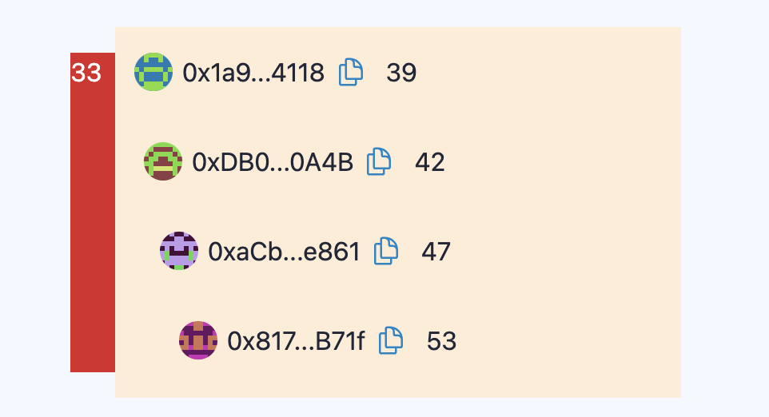

# Inferno Roll
Survive the advancing lava by rolling dice to move your character and outlast other players



⚙️ Built using NextJS, RainbowKit, Hardhat, Wagmi, Viem, and Typescript.

## Gameplay
<h3>To win:</h3>
<p>
  The last player remaining on the game board after all other players have been eliminated by the lava is
  declared the winner
</p>
<h3>Gameplay:</h3>
<ul>
  <li>Players roll a 6-sided dice</li>
  <li>The lava moves the same number of spaces as the player rolls</li>
  <li>If the lava reaches a player&apos;s token, that player is eliminated from the game</li>
  <li>When a new player joins, they move 20 spaces ahead of the lava</li>
  <li>The last player remaining on the board wins the game</li>
</ul>

## Requirements

Before you begin, you need to install the following tools:

- [Node (>= v18.17)](https://nodejs.org/en/download/)
- Yarn ([v1](https://classic.yarnpkg.com/en/docs/install/) or [v2+](https://yarnpkg.com/getting-started/install))
- [Git](https://git-scm.com/downloads)

## Quickstart

To get started with Inferno-Roll, follow the steps below:

1. Clone this repo & install dependencies

```
git clone https://github.com/codechefsong/Inferno-Roll.git
cd Inferno-Roll
yarn install
```

2. Run a local network in the first terminal:

```
yarn chain
```

This command starts a local Ethereum network using Hardhat. The network runs on your local machine and can be used for testing and development. You can customize the network configuration in `hardhat.config.ts`.

3. On a second terminal, deploy the test contract:

```
yarn deploy
```

This command deploys a test smart contract to the local network. The contract is located in `packages/hardhat/contracts` and can be modified to suit your needs. The `yarn deploy` command uses the deploy script located in `packages/hardhat/deploy` to deploy the contract to the network. You can also customize the deploy script.

4. On a third terminal, start your NextJS app:

```
yarn start
```

Visit your app on: `http://localhost:3000`. You can interact with your smart contract using the `Debug Contracts` page. You can tweak the app config in `packages/nextjs/scaffold.config.ts`.
